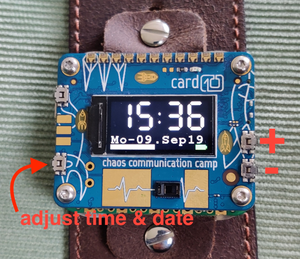

# watch++
An adjustable clock with date and battery display for the [card10 badge](https://card10.badge.events.ccc.de/).
You'll always find the latest revision at [Hatchery](https://badge.team/projects/watch)

### Recommended
* Firmware >= 1.8

## Features
* Displays time as a seven-segment display
* Displays date including current weekday
* Displays seconds as a bar at the bottom of the screen that become brighter the more seconds of a minute has been reached
* Allows changing the time and date completely via buttons
* Automatically adjust brightness of display to safe battery
* Displays the Battery status of your card10-badge
* Display charging icon beneath battery indicator when charging 

## Controls
* long press button in the lower left corner to switch into edit mode
  * allows to set hour, minute, second, day, month, year
* use upper right button to increment value (+)
* use lower right button to decrement value (-)

## Optional

To run watch++ as the defaut app edit the main.py in the root folder of your card10 badge.
Replace the line 

```
default_app = "apps/analog_clock/__init__.py"
```
with 
```
default_app = "apps/watch/__init__.py"
```